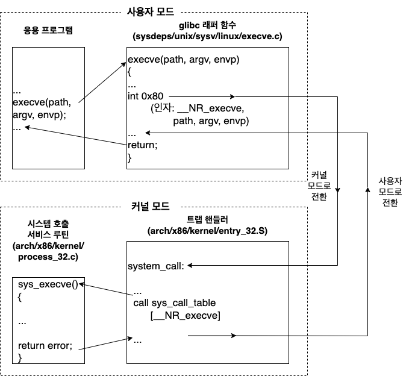

# 시스템 프로그래밍 개념
## 3.1 시스템 호출
`시스템 호출`<sub>system call</sub>은 커널로의 관리된 진입점. \
프로세스가 커널에게 프로세스 대신 어떤 동작을 수행하도록 요청. 

### 시스템 일반적인 사항
* 시스템 호출은 프로세서의 상태를 사용자 모드에서 커널 모드로 변경해서 CPU가 보호된 커널 메모리에 접근할 수 있게 한다.
* 시스템 호출 목록은 고정되어 있다. 각 시스템 호출에는 고유한 숫자가 붙어 있다.
* 각 시스템 호출은 사용자 공간에서 커널 공간으로 가져올 정보를 나타내는 인자들을 가질 수 있다.

### 프로그래밍 관점에서 시스템 호출 단계
1. 응용 프로그램이 C라이브러리의 `래퍼 함수`<sub>wrapper function</sub>를 호출해서 시스템 호출.
1. 래퍼 함수는 시스템 호출의 모든 인자를 시스템 호출 `트랩 처리 루턴`<sub>trap-handling routine</sub>에게 전달, 이 인자는 스택을 통해 래퍼에게 전달되지만, 커널에게 전달하려면 특정 레지스터에 넣어야 함. 래퍼 함수는 인자를 레지스터로 복사.
1. 모든 시스템 호출이 같은 방법으로 커널에 진입, 커널은 시스템 호출을 식별하는 방법이 필요. 이를 위해 래퍼 함수는 시스템 호출 번호를 특정 CPU 레지스터에 복사.
1. 래퍼 함수는 트랩 기계어 명령을 실행하고, 이는 프로세서를 사용자 모드에서 커널 모드로 전환해 시스템의 트랩 벡터가 가르키는 코드를 실행.
1. 트랩을 처리하기 위해 커널은 `system_call()` 루틴을 호출.
	* 레지스터 값들을 커널 스택에 저장.
	* 시스템 호출 번호가 유효한지 확인.
	* 적절한 시스템 호출 서비스 루틴을 호출.
	* 커널 스택에서 레지스터 값들을 복원하고 시스템 호출 리턴값을 스택에 넣음.
	* 래퍼 함수로 돌아오면서, 동시에 프로세서도 사용자 모드로 되돌림.
1. 시스템 호출 서비스 루틴의 리턴값이 에러를 나타내면, 래퍼 함수는 전역 변수 errno를 그 값으로 설정. 래퍼 함수는 그 다음에 시스템 호출의 성공 여부를 나타내는 정수 리턴값을 제공하면서 호출 함수로 리턴.

### Systemcall 예시


## 3.2 라이브러리 함수
상당수의 라이브러리 함수는 시스템 호출을 전혀 사용하지 않음. \
라이브러리 함수는 종종 하부의 시스템 호출보다 사용하기 편리한 인터페이스를 제공하도록 설계됨.

## 3.3 표준 C 라이브러리: GNU C 라이브러리(glib)
### 시스템의 glibc 버전 판별하기
라이브러리를 실행 파일처럼 실행시키면, 버전 번호 등을 출력

**example**

path : /usr/lib/arm-linux-gnueabihf/libc.so.6 

result
```
GNU C Library (Debian GLIBC 2.31-13+rpt2+rpi1+deb11u2) stable release version 2.31.
Copyright (C) 2020 Free Software Foundation, Inc.
This is free software; see the source for copying conditions.
There is NO warranty; not even for MERCHANTABILITY or FITNESS FOR A
PARTICULAR PURPOSE.
Compiled by GNU CC version 10.2.1 20210110.
libc ABIs: UNIQUE ABSOLUTE
For bug reporting instructions, please see:
<http://www.debian.org/Bugs/>.
```

일부 리눅스 배포판에서는 GNU C 라이브러리가 다른곳에 있을 수도 있음. \
라이브러리의 위치를 찾는 방법 중 하나는 glibc와 동적으로 링크된 실행 파일을 대상으로 `ldd`<sub>list dynamic dependencies</sub>프로그램을 실행하는 것.

## 3.4 시스템 호출과 라이브러리 함수의 에러 처리
대부분의 시스템 호출과 라이브러리 함수가 어떤 형태로든 성공 여부를 나타내는 상태값을 리턴. \
이 상태값은 해당 호출이 성공했는지를 알기 위해 언제나 확인해야 함. \
실패했다면 적절한 동작을 취해야 함. \
최소한 프로그램이 뭔가 기대하지 않은 일이 발생했음을 알리는 에러 메세지라도 표시 해야 함.s

### 시스템 호출 에러 처리
각 시스템 호출의 매뉴얼 페이지에는 가능한 리턴값들이 나와 있고, 어느 값이 에러를 나타내는지도 나와 있음. \
보통 -1을 리턴하면 에러를 뜻함. 

**example**
```
fd = open(pathname, flags, mode);	/* 파일을 여는 시스템 호출 */
if (fd == -1) {
	/* 에러 처리 코드 */
}
...
if (close(fd) == -1) {
	/* 에러 처리 코드 */
}
```
시스템 호출이 실패하면 전역 정수 변수 errno를 특정 에러를 나타내는 양수로 설정. \
`<errno.h>`를 사용하면 `errno`선언뿐만 아니라 다양한 에러 상수도 포함됨. \
각 시스템 호출이 리턴할 수 있는 errno 값의 목록이 나와 있음. \
성공적인 시스템 호출과 라이브러리 함수는 절대 errno를 0으로 설정하지 않음. \
이로인해 이전의 함수 호출로 인해 0이 아닌 값을 갖고 있을 수도 있음. \
에러를 확인할 때는 언제나 함수의 리턴값이 에러를 나타내는지 확인하고, 그 경우에만 errno를 통해 에러의 원인을 찾아야 함. \
몇몇 시스템 호출은 성공 시에도 -1을 리턴함. \
그런 호출에서 에러가 발생했는지를 알기 위해서는 호출 전에 errno를 0으로 설정하고, 호출 후에 다시 확인해야 함. \
시스템 호출이 실패한 뒤의 일반적인 동작은 errno 값에 따라 에러 메시지를 출력하는 것.

```c
#include <stdio.h>
void perror(const char *msg)
```

```c
#include <string.h>
char *strerror(int errnum);
```
대표적인 라이브러리 함수 `perror`, `strerror`를 사용함.

### 라이브러리 함수의 에러 처리
다양한 라이브러리 함수가 실패를 알리기 위해 여러 가지 데이터형의 여러 가지 값을 리런.
* 시스템 호출과 똑같이 에러 정보를 리턴하는 라이브러리 함수. -1을 리턴하고 errno에 구체적인 에러 번호를 적음. 이 함수의 에러는 시스템 호출의 에러와 똑같은 방법으로 진단.
* 에러 발생시 -1을 리턴하지는 않지만 errno에 구체적은 에러 번호를 적는 라이브러리 함수.
* errno를 전혀 쓰지 않는 나머지 라이브러리 함수. 에러의 발생 여부와 원인을 알아내는 방법은 함수마다 다르며 해당 함수의 매뉴얼에 적혀 있음.

## 3.5 예제
### 명령행 옵션과 인자
예제 프로그램의 상당수는 명령행 옵션과 인자에 따라 다르게 동작. \
이 옵션을 파싱할 때는 `getopt()` 라이브러리 함수를 쓰면 편리.
### 공통 함수와 헤더 파일

**공통 헤더 파일**

tlpi_hdr.h
```c
#ifndef TLPI_HDR_H
#define TLPI_HDR_H				/* 실수로 두 번 포함시키는 것을 방지한다. */

#include <sys/types.h>			/* 여러 프로그램에 쓰이는 형 정의 */
#include <stdio.h>				/* 표준 I/O 함수 */
#include <stdlib.h>				/* 흔히 쓰이는 라이브러리 함수 프로토타입, EXIT_SUCCESS와 EXIT_FAILURE 상수 */
#include <unistd.h>				/* 여러 시스템 호출 프로토타입 */
#include <errno.h>				/* errno와 에러 상수 정의 */
#include <string.h>				/* 흔히 쓰이는 문자열 처리 함수 */

#include "get_num.h"			/* 수 인자 처리 함수(getInt(), getLong()) 선언 */

#include "error_functions.h"	/* 에러 처리 함수 선언 */

typedef enum { FALSE, TRUE } Boolean;

#define min(m, n) ((m) < (n) ? (m) : (n))
#define max(m, n) ((m) > (n) ? (m) : (n))

#endif
```